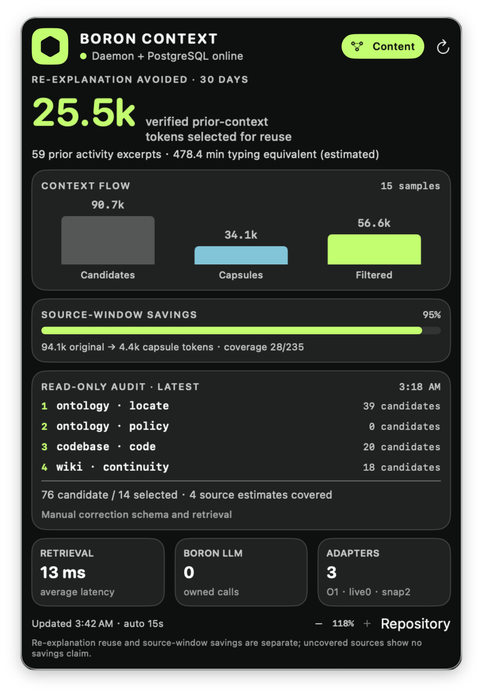
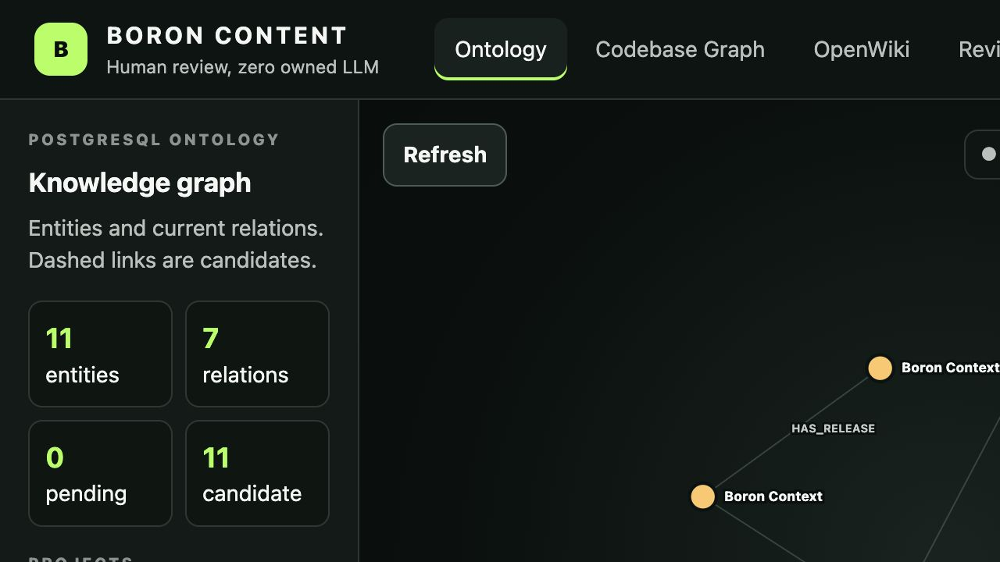
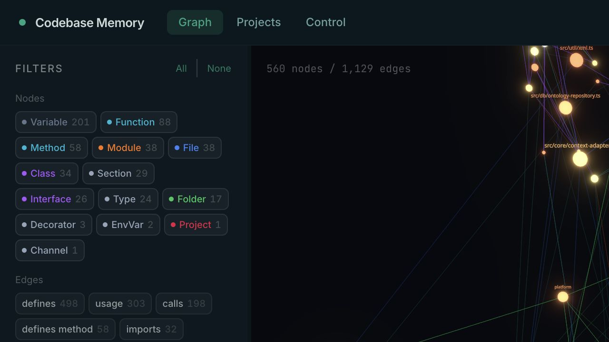
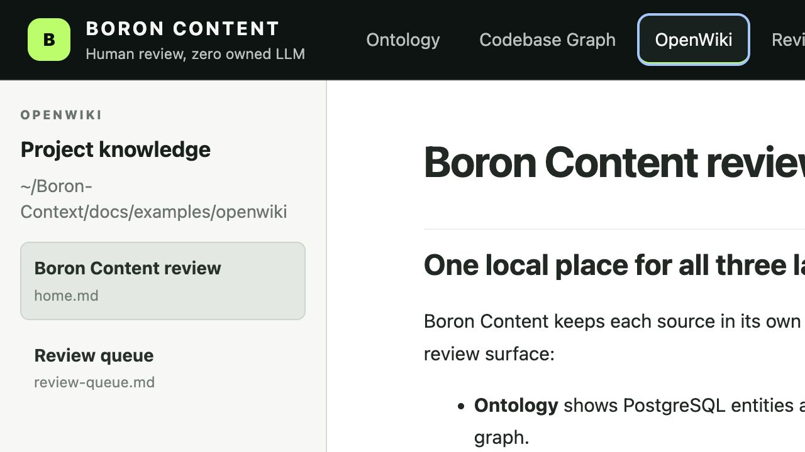

<div align="center">


# Boron Context

**Durable, local project context for coding agents**

[](https://github.com/kforris/boron-context/actions/workflows/ci.yml)
[](LICENSE)
[](#project-status)
[](CHANGELOG.md)

</div>

Boron Context gives Codex and other coding agents a shared, sourced view of your projects across
sessions. Before work starts, it resolves the exact project and returns only the relevant context.
After the work is verified, it preserves the decisions, evidence, and relationship changes that the
next agent should know.

**Boron is not an agent, a chat logger, or a model-training system.** It does not capture raw
transcripts, write back every tool call, or call an LLM by default. It is a local context substrate
that agent clients use through MCP or authenticated HTTP.

[Quick start](#quick-start) · [Codex plugin](#codex-plugin) · [How it works](#how-it-works) ·
[Security](SECURITY.md) · [Project status](#project-status)

## What it does

| When        | Boron Context                                                                                    |
| ----------- | ------------------------------------------------------------------------------------------------ |
| Before work | Resolves an exact project identity and builds a bounded, sourced **Context Capsule**.            |
| During work | Surfaces confirmed constraints, decisions, relationships, code evidence, and documentation.      |
| After work  | Stores selected, verified milestones and relation changes—not the full conversation.             |
| Next time   | Gives an integrated agent the durable project state without reconstructing it from chat history. |

Confirmed meaning lives in PostgreSQL. Uncertain discoveries remain `candidate` until an
authoritative source or a person confirms them. Ambiguous project names fail closed instead of
silently selecting the wrong workspace.

## Quick start

Requirements: Apple Silicon macOS, Node.js 20.19.0 or newer, and PostgreSQL 15 or newer.

```bash
git clone https://github.com/kforris/boron-context.git
cd boron-context
npm install

createdb boron_context
export BORON_DATABASE_URL='postgresql://127.0.0.1/boron_context'
npm run db:migrate

npm run build
npm run service:install
```

Install the bundled Codex plugin:

```bash
codex plugin marketplace add .
codex plugin add boron-context@boron-context
```

Start a new Codex task so the MCP tools and context-continuity skill are loaded. Other agent clients
can integrate through the authenticated HTTP API or configure the same local MCP surface.

## Context sources

Boron keeps context ownership explicit across three independent sources:

1. **Ontology** — projects, objects, typed relationships, intentions, constraints, policies,
   semantic activities, derived state, provenance, and confirmation state.
2. **Codebase Memory** — repositories, symbols, dependencies, routes, call paths, and code-derived
   evidence.
3. **OpenWiki** — recurring questions, operational problems, support knowledge, exceptions,
   decisions, and lessons learned.

The name refers to boron's three valence electrons: three inputs, one bounded context layer.
Each layer remains authoritative for the facts it understands. Boron Context resolves them into a
bounded capsule instead of copying everything into one undifferentiated knowledge base.

## How it works

```text
Codex / Cursor / voice / another agent
                    │
                    ▼
        Local authenticated gateway
                    │
                    ▼
             Intention capture
                    │
                    ▼
        Project and entity resolution
                    │
                    ▼
   Ontology location + policy check
                    │
                    ▼
    Deterministic Retrieval Plan
          │ selected stages only
          ├──▶ Codebase source
          └──▶ Wiki source
                    ▼
       Evidence ranking + policy filter
                    │
                    ▼
        Bounded, sourced Context Capsule
                    │
                    ▼
           External agent execution
                    │
                    ▼
      Semantic activities and decisions return
```

PostgreSQL is the durable source of truth for confirmed meaning. Automatically discovered semantic
relations remain candidates until a person confirms them.

Activity is not a fourth context layer. It is a first-class Ontology primitive. Boron records
events and relation effects, then derives current state from active relations instead of requiring
agents to maintain duplicated status prose.

## Current pre-alpha

This independent repository contains a new headless foundation:

- strict TypeScript contracts for intentions, evidence, and Context Capsules;
- PostgreSQL migrations for projects, objects, relations, evidence, intentions, confirmations, and
  capsules;
- collision-safe project identities and deterministic Codex project-registry reconciliation that
  confirms exact roots while leaving name-only matches as candidates;
- append-only agent sessions and semantic activities with temporal assert/retract relation effects;
- an ontology-first Retrieval Plan that selects sources sequentially from deterministic request
  signals and never requires a model or embedding pre-pass;
- an auditable Context Meter separating re-explanation reuse, measured source-window savings,
  deterministic token estimates, and uncovered counterfactuals;
- a PostgreSQL ontology adapter;
- HTTP adapters for Codebase Memory and OpenWiki-compatible search services;
- deterministic evidence ranking, deduplication, and token-budget packing;
- a loopback-only authenticated HTTP gateway;
- a human-review Boron Content Inspector for Ontology, Codebase Memory, OpenWiki, and pending
  corrections, launched with a one-time browser ticket;
- platform-neutral state paths with macOS and Linux mappings;
- a versioned local MCP surface and Codex plugin;
- a macOS `launchd` service-definition generator;
- an optional native macOS menu-bar meter for live context efficiency and daemon health;
- macOS and Linux CI.

The current API is intentionally small:

- `GET /health`
- `POST /v1/context/resolve`
- `POST /v1/sessions/start`
- `POST /v1/activity/record`
- `POST /v1/sessions/complete`
- `POST /v1/metrics/context`
- `POST /v1/metrics/context/inspect` (read-only, credential-redacted audit preview)
- `GET /inspector` (browser shell; data requires a one-time menu-bar session)
- `POST /v1/inspector/ontology`, `/wiki`, and `/corrections/list`
- `POST /v1/inspector/corrections/create` and `/resolve`

Generic inference rules and a setup surface remain next-stage work. Interfaces may change before
`1.0`.

## Boron Content v0.4.0 visual tour

The native menu panel is now content-driven instead of a fixed-height `ScrollView`. `Command-plus`
and `Command-minus` scale the text and window together, while `Command-0` restores the default.
The maximum size is calculated from 70% of the current screen's visible height, so the complete
meter, audit, runtime tiles, and footer remain in one window with no internal scrollbar. On the
tested desktop the maximum was `118%` at `482 × 714 pt`, exactly 70% of the `1020 pt` visible
height.



The `Content` button opens the authenticated, loopback-only Inspector. PostgreSQL Ontology uses a
clickable relation graph; node and relation edits become pending human corrections instead of
overwriting source facts.



Codebase Memory remains the owner of the maintained 3D symbol and dependency graph. Boron embeds
that viewer and adds project-scoped correction targeting beside it.



OpenWiki presents Markdown as a documentation site with navigation and a correction panel. Local
home-directory paths are compacted to `~` in the UI while canonical source URIs remain unchanged.



See the [v0.4.0 release notes](docs/releases/v0.4.0.md) for behavior, security boundaries, and the
human-correction lifecycle.

## Verify the HTTP API

On first start, Boron Context creates a local authentication token at:

```text
~/Library/Application Support/Boron Context/daemon.token
```

Resolve a context capsule:

```bash
TOKEN="$(tr -d '\n' < "$HOME/Library/Application Support/Boron Context/daemon.token")"

curl -sS http://127.0.0.1:41635/v1/context/resolve \
  -H "Authorization: Bearer $TOKEN" \
  -H 'Content-Type: application/json' \
  -d '{
    "objective": "Explain the constraints relevant to this change",
    "projectHint": "boron-context",
    "tokenBudget": 6000,
    "client": "curl"
  }'
```

The `service:install` command creates a LaunchAgent that keeps the Boron daemon alive across logins
and process failures.

## Codex plugin

The repository includes a local Codex plugin under `plugins/boron-context`. It provides:

- `begin_context_session` to retrieve a project capsule and open an episode;
- `record_activity` to store selected semantic milestones and relation effects;
- `complete_context_session` to preserve verified outcomes and decisions;
- `query_context` for read-only context retrieval.
- `get_context_meter` to inspect context reuse, filtering, source compression, latency, and
  Boron-owned LLM usage.
- `inspect_context_meter` to inspect recent sample composition, Retrieval Plan stages, adapters,
  candidate/selected evidence, and source-estimate coverage without exposing credentials.
- `list_manual_corrections` to read human review requests recorded in Boron Content.
- `resolve_manual_correction` to close a request only after evidence-backed repair or rejection.

The companion skill asks Codex to read before substantive project work and write back after
verification. It deliberately does not capture raw transcripts or every tool call.

The [quick start](#quick-start) installs the repository marketplace and plugin. Start a new Codex
task after installation so the MCP tools and skill are loaded.

For deterministic import of Codex desktop project groups, collision-safe canonical identities,
candidate-only workspace discovery, and the operator verification sequence, see
[Project identity discovery and repair](docs/project-identity-repair.md).

## Ontology-first Retrieval Plan

Every request starts with a deterministic PostgreSQL Ontology location. This lightweight pass
resolves project identity and aliases, project scope, entity aliases, current typed relations,
source anchors, and policy references. Boron does not call an LLM or embedding service before this
step.

The resolver then creates an auditable Retrieval Plan:

- explicit code paths, symbols, repository URLs, and code-oriented objectives route to the
  Codebase stage;
- document URLs, titles, decisions, runbooks, and continuity objectives route to the Wiki stage;
- high-risk intent inserts a confirmed-policy stage before any external-source expansion;
- explicit `layers` constrain expansion, but never remove the initial Ontology validation;
- stages execute sequentially. A live source is preferred when configured; its local PostgreSQL
  snapshot is used only as a labeled fallback.

There is no default all-layer parallel fan-out. A capsule returns `retrievalPlan` with its signals,
source anchors, stage order, adapter names/source types, candidate counts, latency, and any failed
or unavailable stage.

## Context Meter

Every generated capsule contains a deterministic meter:

- candidate and selected evidence counts;
- candidate, capsule, and filtered token estimates;
- re-explanation context avoided by selecting verified excerpts from prior Boron activities;
- source-window savings only when selected evidence supplies a real `sourceTokenEstimate`;
- source-estimate coverage across selected evidence;
- retrieval latency;
- LLM calls and tokens owned by Boron.

The current token estimator is `characters / 4`. `capsuleTokens` measures the serialized capsule
payload (including provenance, Retrieval Plan, and Meter fields); per-evidence tokens include their
serialized provenance wrapper. The request token budget still controls packed context content. The
estimator is deterministic and useful for comparing Boron runs, but it is not a provider invoice.

Query a 30-day project summary through MCP with `get_context_meter`, or through HTTP:

```bash
curl -sS http://127.0.0.1:41635/v1/metrics/context \
  -H "Authorization: Bearer $TOKEN" \
  -H 'Content-Type: application/json' \
  -d '{"projectHint":"Boron Context","windowDays":30}'
```

The meter does not claim a counterfactual it cannot observe. `reExplanation.avoidedTokens` counts
verified prior-context excerpts the user or agent did not need to provide again, but those compact
tokens still enter the agent model. `sourceWindow.savingsTokens` and its ratio are `null` when no
selected evidence has an original source-token estimate. Partial coverage is calculated only over
covered evidence and always carries its evidence/sample coverage alongside the number.

Each sample stores an evidence-level audit row with source adapter/type, URI, title, candidate token
estimate, score, selected state, optional original-source estimate, capsule ID, trace ID, Retrieval
Plan, and timestamp. Query the sanitized read-only preview through `inspect_context_meter` or
`POST /v1/metrics/context/inspect`.

### Current LLM use

Boron Context currently calls **no LLM** and performs no embedding lookup. PostgreSQL Ontology
location, deterministic routing, PostgreSQL full-text search, ranking, deduplication, and budget
packing build the capsule. Codex or another client writes selected semantic summaries during its
existing turn, so Boron has no separate model provider, model bill, or hidden inference call.

Future autonomous extraction may use a client-supplied model, a local model, or an explicitly
configured cloud model. Any such use must appear separately in the meter.

## macOS menu-bar meter

`Boron Meter` is an optional native SwiftUI companion. It stays beside utilities such as Stats,
GPT, or MTMR in the macOS menu bar while the headless daemon remains the source of truth.

The compact menu item shows `R` (re-explanation tokens avoided) and `S` (measured source-window
savings, or `—` when uncovered). Clicking it opens a local panel with:

- candidate, capsule, and filtered token estimates;
- verified re-explanation context and estimated manual re-entry equivalent;
- source-window savings and evidence coverage, or an explicit not-calculable state;
- the latest read-only audit sample, Retrieval Plan stage order, and selected evidence provenance;
- retrieval latency, healthy layers, and Boron-owned LLM calls;
- daemon and PostgreSQL health.

It polls `127.0.0.1:41635` every 15 seconds and reads the existing local daemon token. It sends no
telemetry and adds no LLM calls or cloud cost.

Build, install to `~/Applications/Boron Meter.app`, and keep it available at login:

```bash
npm run db:migrate
npm run build
npm run service:install
python3 scripts/install_menubar.py
```

The installer starts the menu-bar item automatically; click `B R… · S…`, then use the `Content`
button in the top toolbar to open the authenticated Inspector. The app requires macOS 14 or newer
and the migrated Boron Context daemon.

Manual fields and notes are stored as pending corrections, not applied directly to Ontology,
Codebase Memory, or Markdown. At the next Boron-backed project session, the Agent receives those
requests as high-authority review evidence, checks current sources, repairs or rejects the semantic
relationship, and resolves the correction. The Inspector itself performs no LLM calls.

## Context Capsule budget

The default capsule budget is approximately **6,000 tokens**, with a request hard limit of
**16,000 tokens**. Token counts are deterministic estimates, not model-provider billing values.

The resolver ranks evidence using:

- relevance to the objective and constraints;
- authority and confidence;
- project identity match;
- source provenance;
- stable deduplication.

The target is to reduce repeated broad repository reads, not to make the prompt longer.

## Configuration

| Variable                          | Default                                | Purpose                           |
| --------------------------------- | -------------------------------------- | --------------------------------- |
| `BORON_DATABASE_URL`              | `postgresql://127.0.0.1/boron_context` | PostgreSQL connection             |
| `BORON_HOST`                      | `127.0.0.1`                            | Gateway bind host                 |
| `BORON_PORT`                      | `41635`                                | Gateway port                      |
| `BORON_DAEMON_TOKEN`              | generated file                         | Explicit in-memory token override |
| `BORON_TOKEN_FILE`                | platform state path                    | Token file override               |
| `BORON_OPENWIKI_ROOT`             | `~/.openwiki/wiki`                     | Inspector Markdown root           |
| `BORON_CODEBASE_MEMORY_GRAPH_URL` | `http://127.0.0.1:9749`                | Inspector graph UI/RPC endpoint   |
| `BORON_CODEBASE_MEMORY_COMMAND`   | `~/.local/bin/codebase-memory-mcp`     | Optional graph UI sidecar command |
| `BORON_CODEBASE_MEMORY_URL`       | unset                                  | Codebase Memory search adapter    |
| `BORON_CODEBASE_MEMORY_TOKEN`     | unset                                  | Codebase Memory bearer token      |
| `BORON_OPENWIKI_URL`              | unset                                  | OpenWiki search adapter           |
| `BORON_OPENWIKI_TOKEN`            | unset                                  | OpenWiki bearer token             |

Adapter truth is explicit in `/health`, every Retrieval Plan, and the menu bar:

| Reported source type | Meaning                                                                  |
| -------------------- | ------------------------------------------------------------------------ |
| `ontology`           | Live PostgreSQL Ontology used for deterministic location and policy      |
| `snapshot`           | Selected evidence already stored in PostgreSQL; external source not live |
| `live`               | Configured HTTP source adapter was actually selected and queried         |

The current default installation has PostgreSQL Ontology plus local Codebase/Wiki evidence
snapshots. Codebase Memory is live only when `BORON_CODEBASE_MEMORY_URL` is configured and healthy;
OpenWiki is live only when `BORON_OPENWIKI_URL` is configured and healthy.

The gateway refuses non-loopback bindings unless `BORON_ALLOW_REMOTE=true`. That override is not a
complete remote security design; use it only behind an independently authenticated boundary.

## Development

```bash
npm run typecheck
npm test
npm run build
npm run check
npm audit --omit=dev --audit-level=high
```

See:

- [Operating manual](docs/operating-manual.md) / [简体中文](docs/operating-manual.zh-CN.md)
- [Context-engineering methodology](docs/context-engineering-methodology.md) /
  [简体中文](docs/context-engineering-methodology.zh-CN.md)
- [System design](docs/architecture/system-design.md)
- [Product roadmap](docs/architecture/product-roadmap.md)
- [Contributing](CONTRIBUTING.md)
- [Security policy](SECURITY.md)
- [Changelog](CHANGELOG.md)

## Product stages

### Stage 1 — macOS-first, headless-first

Stabilize installation, `launchd`, PostgreSQL, source adapters, MCP/HTTP, Context Capsules, backup,
and confirmation on a MacBook without requiring a permanent GUI.

Linux follows with `systemd` and XDG paths while preserving the same ontology and API contracts.

### Stage 2 — evaluate an optional independent application at 1.0

No independent product UI is planned before the 1.0 evaluation. A later application may provide
setup, ontology inspection, relationship confirmation, policy control, and diagnostics. The
headless daemon remains independently usable and authoritative; the current menu-bar meter stays a
read-only operational companion.

## Project status

Boron Context is **pre-alpha**. It is suitable for architecture review and local development, not
production deployment with sensitive data.

The next release gates are:

1. local folder, Git, and Codebase Memory discovery;
2. configurable activity-to-relation inference rules;
3. candidate confirmation and correction workflow;
4. tested macOS service installation, upgrade, and uninstall;
5. reproducible PostgreSQL backup and restore;
6. Linux `systemd` packaging.

## Independence and inspiration

Boron Context is a new project with its own repository, implementation, history, governance, and
product scope. It is not a fork of Machina and is not affiliated with that project.

Some of its product questions were inspired by earlier experiments around Machina, but no Machina
source history or application code is included. The direction was also informed by Palantir's
public Ontology concepts. Boron Context applies those lessons to an open, local-first context layer
for individuals and small teams.

## License

[MIT](LICENSE)
