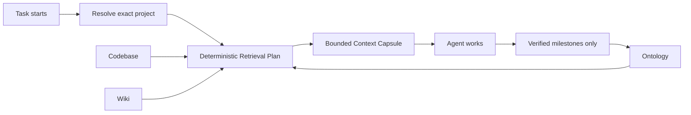

<div align="center">


# Boron Context

**Persistent project context for coding agents.**

[English](README.md) · [简体中文](README.zh-CN.md)

[](https://github.com/kforris/boron-context/actions/workflows/ci.yml)
[](https://github.com/kforris/boron-context/releases/latest)
[](LICENSE)
[](#project-status)

</div>

**Your coding agents should understand a project better every time they work on it.**

Boron Context is an open-source, local context layer for Codex and other coding agents. It gives
each task a small, sourced **Context Capsule**, then preserves only verified decisions, outcomes,
and relationship changes for the next agent.

> No transcript warehouse. No default LLM. No private Codex-state patching. Uncertain facts stay
> reviewable, and ambiguous project identities fail closed.

[Get started](#quick-start) · [How it works](#how-it-works) ·
[Codex integration](#automatic-with-codex) · [Spatial Inspector](#spatial-inspector) ·
[Documentation](#documentation) ·
[Security](SECURITY.md)

## Why Boron

Coding agents are capable inside one task, but project understanding is usually trapped in chat
history. The next task spends time rediscovering the repository, decisions, constraints, and current
state.

Boron turns that repeated explanation into durable project infrastructure:

| At task start                                                          | During work                                           | For the next task                                           |
| ---------------------------------------------------------------------- | ----------------------------------------------------- | ----------------------------------------------------------- |
| Resolve the exact project and retrieve only relevant, sourced context. | Keep uncertain facts separate from confirmed meaning. | Reuse verified outcomes without replaying the conversation. |

The agent is not retrained. The **project context** becomes more structured, sourced, and reusable.

## Quick start

Current requirements: Apple Silicon macOS, Node.js 20.19 or newer, and PostgreSQL 15 or newer.

```bash
git clone https://github.com/kforris/boron-context.git
cd boron-context
npm install

createdb boron_context
export BORON_DATABASE_URL='postgresql://127.0.0.1/boron_context'
npm run db:migrate
npm run build
npm run service:install
```

Install the bundled Codex plugin:

```bash
codex plugin marketplace add .
codex plugin add boron-context@boron-context
```

Review the two Boron lifecycle commands once in a Codex surface that exposes hook review
(`/hooks` in the CLI), then start a new task. Confirm that the task contains
`Boron automatic project context`.

### Optional: add Boron to the macOS menu bar

Install the native read-only Context Meter:

```bash
python3 scripts/install_menubar.py
```

The installer builds the Swift app, places it at `~/Applications/Boron Meter.app`, registers a
per-user LaunchAgent, and starts it immediately. A Boron hexagon and health status appear in the
macOS menu bar. Click it to inspect the local daemon, context flow, source coverage, latest
read-only audit, and adapter state.

<p align="center">
  <a href="docs/assets/screenshots/v0.7.1/boron-menubar-finished-state.png">
    
  </a>
</p>

<p align="center"><sub>Real example from a populated local installation; metrics vary with each machine's projects and usage.</sub></p>

See the [operating manual](docs/operating-manual.md) for upgrades, menu-bar troubleshooting,
verification, and recovery.

## How it works



Every request starts with project and entity resolution in the PostgreSQL Ontology. A deterministic
Retrieval Plan then selects only the code or knowledge sources relevant to the task. Boron ranks,
deduplicates, and packs the evidence into a bounded capsule.

Boron currently makes **zero LLM calls**. The client agent does the reasoning and writes back only
verified semantic milestones after the work is checked.

### Three context sources

| Source       | Owns                                                                                        |
| ------------ | ------------------------------------------------------------------------------------------- |
| **Ontology** | Projects, entities, typed relationships, constraints, policies, activities, and provenance. |
| **Codebase** | Repositories, symbols, dependencies, routes, and code-derived evidence.                     |
| **Wiki**     | Decisions, runbooks, recurring problems, exceptions, and lessons learned.                   |

The sources remain independently authoritative. `live`, `snapshot`, and `ontology` evidence are
explicitly labeled; a stored snapshot is never presented as a live external connection.

## Automatic with Codex

After the one-time trust review, the bundled plugin provides an invisible continuity loop:

- `SessionStart` synchronizes privacy-safe task ownership and loads a project-scoped capsule;
- the agent can expand context through MCP when the task needs more evidence;
- verified decisions and outcomes are recorded as semantic activities;
- `SessionEnd` closes an unfinished session as `partial` if explicit completion did not run; and
- the next task can resume from confirmed project state.

Historical task ownership lives in a dedicated Boron retrieval index—not in the Ontology graph and
not in the Codex sidebar. The sync sends IDs, classification, authority, confidence, and evidence
digests only. It does not send task titles, prompts, previews, transcripts, or working directories.

Other agent clients can use the same local MCP server or authenticated HTTP API. Continuity becomes
automatic only when that client actually integrates Boron.

## Spatial Inspector

Boron can project the review graph into a desktop 3D workbench or Quest 3 passthrough without
turning the daemon into a remote service. The view reveals context progressively:

- **L0** — project and architecture clusters;
- **L1** — representative symbols for one selected cluster;
- **L2** — a separately queried, bounded one-hop caller/callee graph.

The projection contains names, provenance/confirmation state, and typed derived edges—not source
files or repository text. The optional LAN gateway is a separate paired, read-only HTTPS process;
the privileged daemon remains on loopback. See the
[Quest setup and trust procedure](docs/operating-manual.md#quest-3-lan-spatial-inspector-recommended).

## Trust and privacy

- The gateway binds to loopback by default and requires a generated bearer token.
- Raw conversations, credentials, complete documents, and repository dumps are not context records.
- Only deterministic authoritative evidence or explicit human approval becomes `confirmed`.
- Model-inferred or weakly matched relationships remain `candidate`.
- Equal-authority identity conflicts fail closed instead of choosing by row order.
- Unknown temporary directories do not create confirmed projects.
- Hook failures fail open, so Boron cannot prevent the coding agent from starting.
- Optional Quest LAN access uses a separate read-only process, single-use pairing, and mandatory
  CA SHA-256 fingerprint comparison; it does not widen the daemon listener.

Read the [security policy](SECURITY.md) and
[project identity repair contract](docs/project-identity-repair.md) before remote exposure or bulk
identity changes.

## Project status

Boron Context is **pre-alpha** and currently optimized for local development on Apple Silicon macOS.
The v0.7 foundation includes:

- trusted Codex lifecycle hooks and resumable, leased sessions;
- privacy-safe, idempotent task-to-project synchronization;
- collision-safe Codex and operator-approved independent project identities with auditable supersession;
- PostgreSQL Ontology, live Codebase Memory, and live Markdown Wiki adapters;
- candidate/confirmed relationship boundaries and human correction requests;
- Context Meter, structured context-quality health, adoption health, and source-truth audit surfaces;
- an authenticated local Inspector, paired read-only Quest 3 LAN WebXR projection, and optional
  native macOS menu-bar meter; and
- macOS and Linux CI.

Interfaces may change before `1.0`. Linux service packaging, a signed installer, setup UX, and
configurable inference/confirmation rules remain roadmap work.

## Documentation

| Goal                                          | Start here                                                                                                         |
| --------------------------------------------- | ------------------------------------------------------------------------------------------------------------------ |
| Install, upgrade, or recover                  | [Operating manual](docs/operating-manual.md) · [简体中文](docs/operating-manual.zh-CN.md)                          |
| Understand the architecture                   | [System design](docs/architecture/system-design.md)                                                                |
| Inspect APIs, configuration, and plugin tools | [Reference](docs/reference.md)                                                                                     |
| Understand the context-engineering method     | [Methodology](docs/context-engineering-methodology.md) · [简体中文](docs/context-engineering-methodology.zh-CN.md) |
| Review task-to-project ownership              | [Codex task context](docs/codex-thread-project-reconciliation.md)                                                  |
| Repair project identity safely                | [Project identity repair](docs/project-identity-repair.md)                                                         |
| See what changed in v0.7.1                    | [Release notes](docs/releases/v0.7.1.md) · [Changelog](CHANGELOG.md)                                               |
| Follow the product direction                  | [Roadmap](docs/architecture/product-roadmap.md)                                                                    |
| Contribute                                    | [Contributing guide](CONTRIBUTING.md)                                                                              |

## Development

```bash
npm run check
npm run format:check
npm audit --omit=dev --audit-level=high
```

PostgreSQL integration and native menu-bar checks are documented in the
[operating manual](docs/operating-manual.md#10-verification-after-upgrade). Contributions are
welcome; please keep source provenance, privacy boundaries, and candidate/confirmed semantics
explicit.

## License

[MIT](LICENSE)
