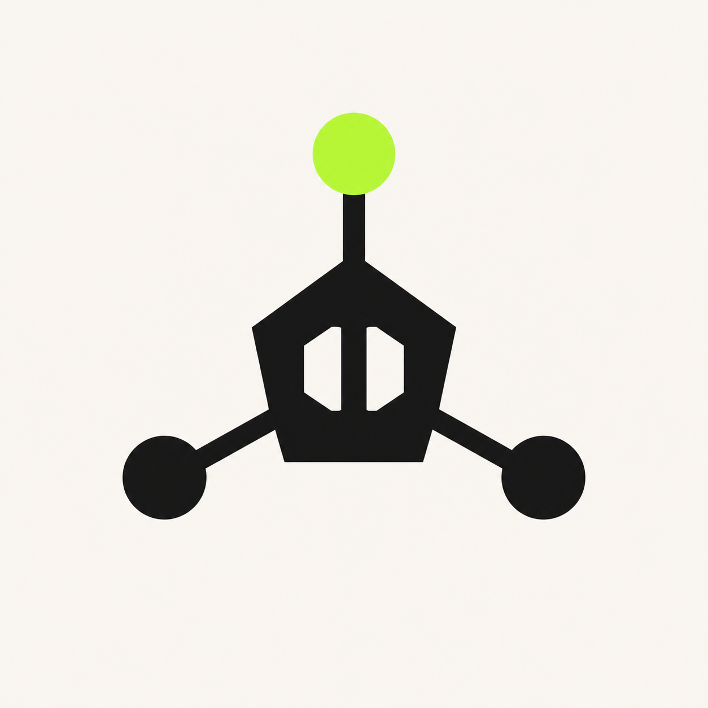
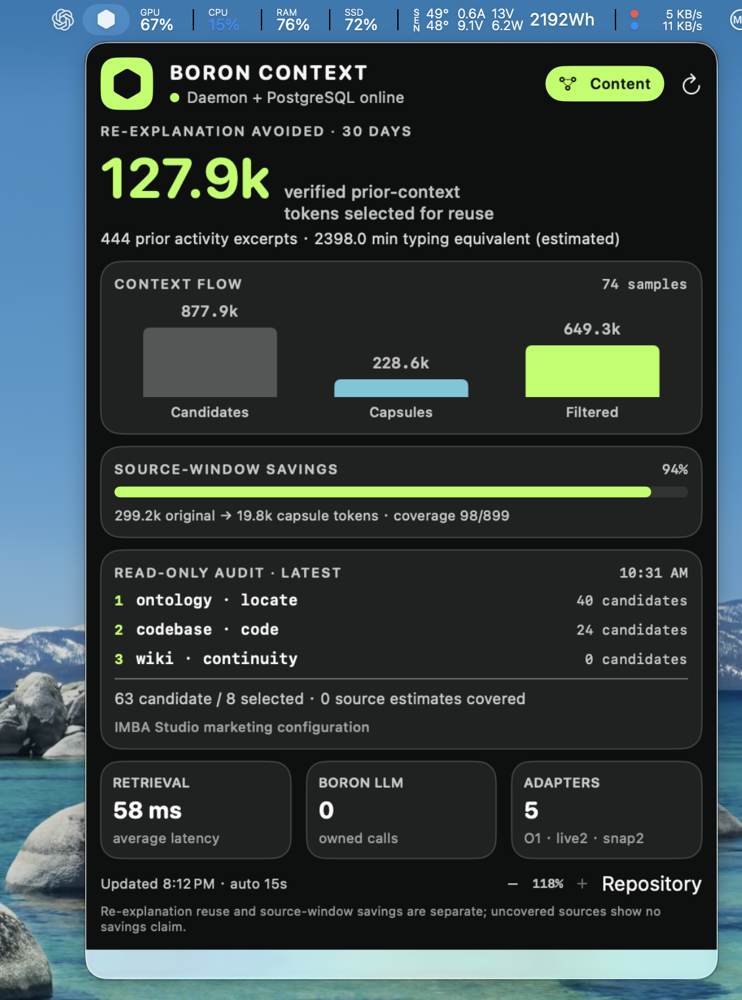
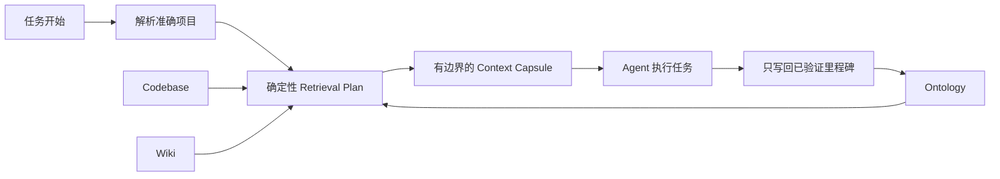

<div align="center">



# Boron Context

**面向 Coding Agent 的持久项目上下文。**

[English](README.md) · [简体中文](README.zh-CN.md)

[](https://github.com/kforris/boron-context/actions/workflows/ci.yml)
[](https://github.com/kforris/boron-context/releases/latest)
[](LICENSE)
[](#项目状态)

</div>

**Coding Agent 每次参与项目，都应该比上一次更理解它。**

Boron Context 是面向 Codex 和其他 Coding Agent 的开源、本地上下文底座。每个任务开始时，
它会提供一份小而有来源的 **Context Capsule**；任务验证完成后，只保留下一位 Agent 真正需要的
决策、结果和关系变化。

> 不建立对话仓库；默认不调用 LLM；不修改 Codex 私有状态。未确定的事实保持可审阅，项目
> 身份存在歧义时 fail-closed。

[快速开始](#快速开始) · [工作原理](#工作原理) · [Codex 自动接入](#codex-自动接入) ·
[Spatial Inspector](#spatial-inspector) · [文档导航](#文档导航) · [安全说明](SECURITY.md)

## 为什么需要 Boron

Coding Agent 在单次任务中已经很强，但项目理解通常被困在聊天记录里。下一次任务仍要重新查找
仓库结构、历史决策、约束条件和当前状态。

Boron 把这些反复解释转化为耐久的项目基础设施：

| 任务开始                                   | 工作期间                           | 下一次任务                           |
| ------------------------------------------ | ---------------------------------- | ------------------------------------ |
| 解析准确项目，只检索相关且有来源的上下文。 | 把未确定事实与已确认语义明确分开。 | 复用已验证结果，而不是重放整段对话。 |

变聪明的不是重新训练后的模型，而是变得更结构化、有来源、可复用的**项目上下文**。

## 快速开始

当前要求：Apple Silicon macOS、Node.js 20.19 或更新版本，以及 PostgreSQL 15 或更新版本。

```bash
git clone https://github.com/kforris/boron-context.git
cd boron-context
npm install

createdb boron_context
export BORON_DATABASE_URL='postgresql://127.0.0.1/boron_context'
npm run db:migrate
npm run build
npm run service:install
```

安装仓库内置的 Codex plugin：

```bash
codex plugin marketplace add .
codex plugin add boron-context@boron-context
```

在支持 hook 审查的 Codex 入口中检查一次 Boron 的两个生命周期命令（CLI 使用 `/hooks`），
然后新建任务。确认任务中出现 `Boron automatic project context`。

### 可选：加载到 macOS 菜单栏

安装只读的原生 Context Meter：

```bash
python3 scripts/install_menubar.py
```

安装脚本会构建 Swift 程序、安装到 `~/Applications/Boron Meter.app`、注册当前用户的
LaunchAgent，并立即启动。macOS 顶部菜单栏会出现 Boron 六边形图标和健康状态；点击图标即可
查看本地 daemon、Context Flow、来源覆盖、最近一次只读审计与 adapter 状态。

<p align="center">
  <a href="docs/assets/screenshots/v0.7.1/boron-menubar-finished-state.png">
    
  </a>
</p>

<p align="center"><sub>已有本地数据的真实运行示例；指标会随每台机器的项目与使用情况变化。</sub></p>

升级、菜单栏故障排查、验证与恢复流程见[运营手册](docs/operating-manual.zh-CN.md)。

## 工作原理



每个请求都先在 PostgreSQL Ontology 中解析项目和实体，再由确定性的 Retrieval Plan 选择与
当前任务相关的代码或知识来源。Boron 对证据进行排序、去重，并打包为有边界的 Capsule。

Boron 当前自身发起的 LLM 调用数为 **0**。推理由客户端 Agent 完成；只有在真实结果验证后，
才写回选中的语义里程碑。

### 三类上下文来源

| 来源         | 负责内容                                                               |
| ------------ | ---------------------------------------------------------------------- |
| **Ontology** | 项目、实体、typed relationship、约束、policy、activity 与 provenance。 |
| **Codebase** | 仓库、symbol、dependency、route 与代码证据。                           |
| **Wiki**     | 决策、runbook、重复问题、例外与经验。                                  |

三类来源各自保留权威边界。证据会明确标记为 `live`、`snapshot` 或 `ontology`；已保存的快照
不会被描述成实时外部连接。

## Codex 自动接入

完成一次信任审查后，内置 plugin 会形成无感的连续上下文循环：

- `SessionStart` 同步不含内容的任务归属，并加载项目级 Capsule；
- 当前任务需要更多证据时，Agent 可以通过 MCP 扩展上下文；
- 已验证的决策和结果会作为语义 activity 写回；
- 如果没有显式完成，`SessionEnd` 会把未收口 session 关闭为 `partial`；
- 下一次任务从已确认的项目状态继续。

历史任务归属存放在 Boron 专用检索索引中，而不是 Ontology 图或 Codex 侧边栏。同步只发送 ID、
分类、authority、confidence 和证据摘要，不发送任务标题、prompt、preview、transcript 或工作
目录。

其他 Agent 可以通过同一个本地 MCP server 或带认证的 HTTP API 接入。只有客户端真正集成
Boron 后，连续上下文才会自动发生。

## Spatial Inspector

Boron 可以把审阅图投射到桌面 3D workbench 或 Quest 3 passthrough 中，同时不把 daemon 变成
远程服务。视图按层级逐步展开：

- **L0**：项目与架构 cluster；
- **L1**：所选 cluster 的代表性 symbol；
- **L2**：单独查询、带上限的一跳 caller/callee 图。

投影只包含名称、provenance/confirmation state 和 typed derived edge，不包含源文件或仓库正文。
可选 LAN gateway 是独立、配对式、只读的 HTTPS 进程；高权限 daemon 仍只监听 loopback。
设置步骤与信任边界见
[Quest 操作说明](docs/operating-manual.zh-CN.md#quest-3-lan-spatial-inspector)。

## 信任与隐私

- Gateway 默认只绑定 loopback，并要求使用自动生成的 bearer token。
- 原始对话、凭据、完整文档和仓库 dump 不属于上下文记录。
- 只有确定性权威证据或明确人工批准可以成为 `confirmed`。
- 模型推断或弱匹配关系保持 `candidate`。
- 同权威身份冲突会 fail-closed，不按数据库行顺序选择。
- 未登记的临时目录不会自动创建 confirmed 项目。
- Hook 失败时 fail-open，不会阻止 Coding Agent 启动。
- 可选 Quest LAN 接入使用独立只读进程、单次 pairing 和强制 CA SHA-256 指纹比对，不扩大
  daemon 的监听范围。

远程暴露服务或批量修改身份前，请阅读[安全策略](SECURITY.md)与
[项目身份修复契约](docs/project-identity-repair.md)。

## 项目状态

Boron Context 当前为 **pre-alpha**，主要面向 Apple Silicon macOS 上的本地开发。v0.7
基础能力包括：

- 受信任的 Codex 生命周期 hook，以及可续接、带 lease 的 session；
- 隐私安全、幂等的 task-to-project 同步；
- 防碰撞的 Codex 与人工批准独立项目身份，以及可审计 supersession；
- PostgreSQL Ontology、实时 Codebase Memory 与实时 Markdown Wiki adapter；
- candidate/confirmed 关系边界和人工 correction 请求；
- Context Meter、结构化上下文质量、接入健康度与来源真实性审计；
- 带认证的本地 Inspector、配对式只读 Quest 3 局域网 WebXR 投影和可选的 macOS 原生菜单栏 Meter；
- macOS 与 Linux CI。

`1.0` 前接口可能变化。Linux service 打包、签名安装器、setup UX 与可配置推断/确认规则仍在
roadmap 中。

## 文档导航

| 目标                          | 从这里开始                                                                                                   |
| ----------------------------- | ------------------------------------------------------------------------------------------------------------ |
| 安装、升级或恢复              | [运营手册](docs/operating-manual.zh-CN.md) · [English](docs/operating-manual.md)                             |
| 理解系统架构                  | [System design](docs/architecture/system-design.md)                                                          |
| 查询 API、配置与 plugin tools | [Reference](docs/reference.md)                                                                               |
| 理解上下文工程方法            | [方法论](docs/context-engineering-methodology.zh-CN.md) · [English](docs/context-engineering-methodology.md) |
| 审阅 task-to-project 归属     | [Codex task context](docs/codex-thread-project-reconciliation.md)                                            |
| 安全修复项目身份              | [Project identity repair](docs/project-identity-repair.md)                                                   |
| 运行 held-out continuity 评测 | [Evaluation contract](docs/continuity-evaluation.md)                                                         |
| 查看 v0.7.6 变化              | [Release notes](docs/releases/v0.7.6.md) · [Changelog](CHANGELOG.md)                                         |
| 查看产品方向                  | [Roadmap](docs/architecture/product-roadmap.md)                                                              |
| 参与贡献                      | [Contributing guide](CONTRIBUTING.md)                                                                        |

## 开发验证

```bash
npm run check
npm run eval:continuity
npm run format:check
npm audit --omit=dev --audit-level=high
```

PostgreSQL 集成测试和原生菜单栏验证见
[运营手册](docs/operating-manual.zh-CN.md#10-升级后的验证)。欢迎贡献；请始终明确来源、隐私
边界和 candidate/confirmed 语义。

## License

[MIT](LICENSE)
