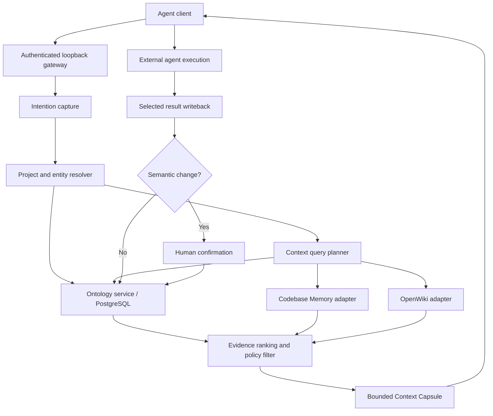

# Boron Context system design

## Product boundary

Boron Context is a headless intention and context layer. Agent clients own input, conversation,
execution, and presentation. Boron Context owns the resolution of project meaning, relevant
evidence, constraints, provenance, and confirmation state.

## Principles

1. Headless-first.
2. macOS-first, platform-neutral.
3. PostgreSQL stores durable confirmed meaning.
4. Source systems remain authoritative for their native facts.
5. Inference is a candidate, not truth.
6. Context responses are bounded and attributable.
7. Execution stays external.
8. A future application remains optional.

## Three context layers

| Layer           | Authority                                                                                       |
| --------------- | ----------------------------------------------------------------------------------------------- |
| Ontology        | Projects, objects, activities, typed relations, derived state, policy, provenance, confirmation |
| Codebase Memory | Repositories, files, symbols, dependencies, routes, call paths, code versions                   |
| OpenWiki        | Explanations, recurring questions, incidents, exceptions, decisions, operational lessons        |

## Request lifecycle



1. A client submits an objective and optional project hints.
2. The gateway authenticates the local client and assigns a trace ID.
3. Stable paths and source identifiers resolve the project before natural-language similarity.
4. PostgreSQL supplies confirmed ontology and policy.
5. The planner selects the required context layers.
6. Weak, stale, unauthorized, or redundant evidence is removed.
7. The resolver returns a capsule within the requested token budget.
8. The external agent executes with its own tools and permissions.
9. Selected activities, evidence, and decisions return as append-only events.
10. Event effects assert or retract temporal relations; current state is derived from active links.
11. Durable model-inferred semantic changes remain candidates until confirmation.

## Context Meter

Each capsule reports deterministic metrics and stores them in PostgreSQL:

| Metric                    | Meaning                                                                |
| ------------------------- | ---------------------------------------------------------------------- |
| `capsuleTokens`           | Estimated tokens actually returned by Boron                            |
| `filteredTokens`          | Candidate excerpt tokens omitted by ranking and budget packing         |
| `recoveredContextTokens`  | Returned tokens originating from earlier Boron activities              |
| `sourceCompressionTokens` | Original-source estimate minus selected excerpt, where coverage exists |
| `retrievalLatencyMs`      | Time spent resolving and packing the capsule                           |
| `boronLlm.calls`          | LLM calls performed and owned by Boron; currently always zero          |

Token estimates use characters divided by four. Manual re-entry time is presented only as an
equivalent at a stated typing speed. It is not observed human time. Source-window reduction remains
unknown unless ingestion provides `sourceTokenEstimate`.

## Activity and derived state

Activity is an Ontology primitive rather than a fourth context layer. An activity records what
happened, when it happened, who or what participated, and the source evidence. Relation effects
change the valid-time interval of typed links.

```text
Activity: A LEFT B
Effect: retract A OCCUPIES B at t
Derived query: B is empty when no active OCCUPIES links remain at t
```

The durable source is the event and relation-effect history. Frequently requested current state may
be materialized for latency, but it must remain reproducible from that history. Incomplete or
conflicting evidence yields `unknown`, not an invented Boolean state.

## Context Capsule

A capsule contains:

- objective and trace ID;
- resolved project identity;
- explicit constraints;
- ranked evidence with layer, URI, confidence, authority, and source version;
- unresolved assumptions;
- estimated token use and truncation state.

The default target is 6,000 estimated tokens. Requests are capped at 16,000.

## Storage

PostgreSQL stores:

- sources and source snapshots;
- projects and objects;
- typed relations and revisions;
- intentions and confirmation requests;
- evidence references and hashes;
- generated Context Capsules;
- agent sessions, semantic activities, and temporal relation effects;
- policies and authorization decisions as the system matures.

Code graphs and Wiki bodies remain in their owning systems. PostgreSQL stores stable references and
selected excerpts, not wholesale copies.

## Platform architecture

### macOS

- Apple Silicon first;
- `launchd` background service;
- Application Support and Library Logs directories;
- generated local bearer token with mode `0600`;
- local PostgreSQL or an explicitly configured server.

### Linux

- same daemon, schema, adapters, and HTTP/MCP contracts;
- `systemd` service adapter;
- XDG configuration and state paths;
- equivalent loopback authentication and filesystem boundaries.

Platform behavior stays behind adapters. The ontology and capsule formats do not branch by OS.

## Target modules

```text
src/
  core/       contracts, ranking, capsule construction
  adapters/   Codebase Memory, OpenWiki, future sources
  db/         PostgreSQL migrations and ontology repository
  gateway/    local HTTP transport
  plugin/     Codex skill and MCP transport
  platform/   macOS and Linux lifecycle and paths
```

## Security invariants

- Loopback binding is the default.
- Remote access requires an explicit override and an external security boundary.
- Requests have bounded bodies and bounded output budgets.
- Credentials never enter capsules.
- Source and project authorization is checked before evidence delivery.
- A model cannot silently confirm its own semantic inference.
